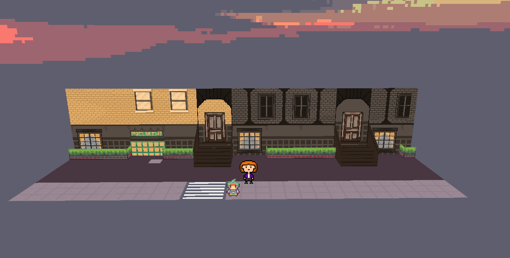

# Ted-s-memories

Игра посвящена популярному сериалу «How I Met Your Mother» («Как я встретил вашу маму»). Она сделана в стиле pixel-art с использованием игрового движка RPG Paper Maker.

Главный герой отправляется в путешествие по воспоминаниям Теда Мосби. Пользователи погружаются в атмосферу знакомого сериала, оказываясь в реалистичных пиксельных локациях, где можно свободно гулять, осматривать знакомые места и даже прослушивать аудиофрагменты диалогов из разных эпизодов шоу.

Особое внимание я уделяла созданию уникальной графики. Для этого использовалась программа Piskel, в которой я создала около ста тайлов для стен, шестнадцать отдельных персонажей и несколько простых анимаций. Тайлы были собраны в наборы с помощью приложения Tilesetter Lite и экспортированы в RPG Paper Maker. 

Также я использовала стандартный инструментарий RPG Paper Maker для добавления трехмерных объектов в собранные локации. Дополнительно, каждая сцена сопровождается оригинальными звуковыми дорожками, подобранными специально для передачи атмосферы сериала.

# Скриншоты
## Локации
| Street | Bar | Home1|
|----------|--------|--------|
|  |  |  

| Home2 | Maze | Memories|
|----------|--------|--------|
|  |  |  |  

## Кадры из игры
| 1 | 2 | 3|
|----------|--------|--------|
|  |  |  

| 4 | 5 | 6|
|----------|--------|--------|
|  |  |  

## Стены
Ниже представлено несколько стен из игры
| 1 | 2 | 3|
|----------|--------|--------|
|  |  |  

| 4 | 5 | 6|
|----------|--------|--------|
|  |  | 

| 7 | 8 | 9|
|----------|--------|--------|
|  |  | 

